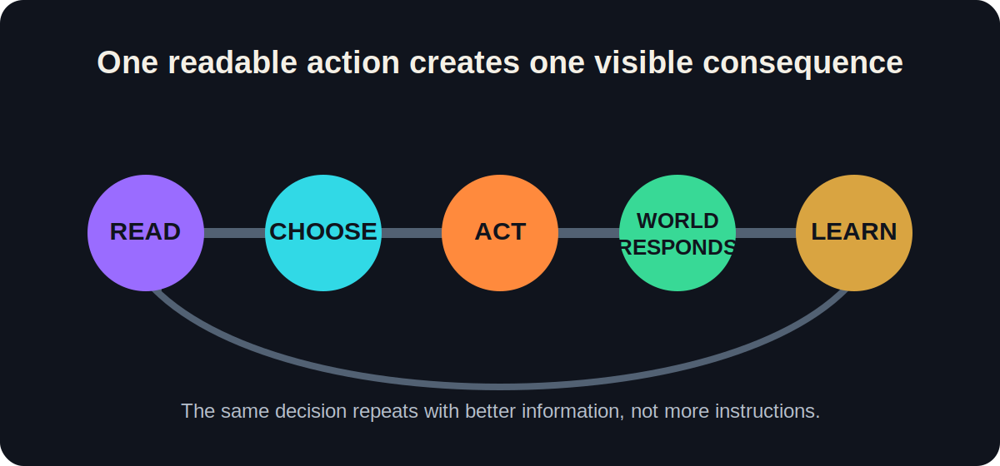
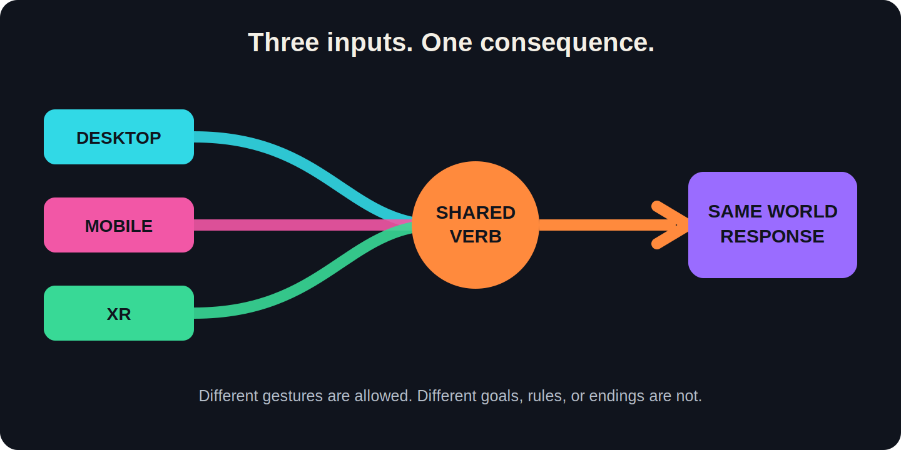
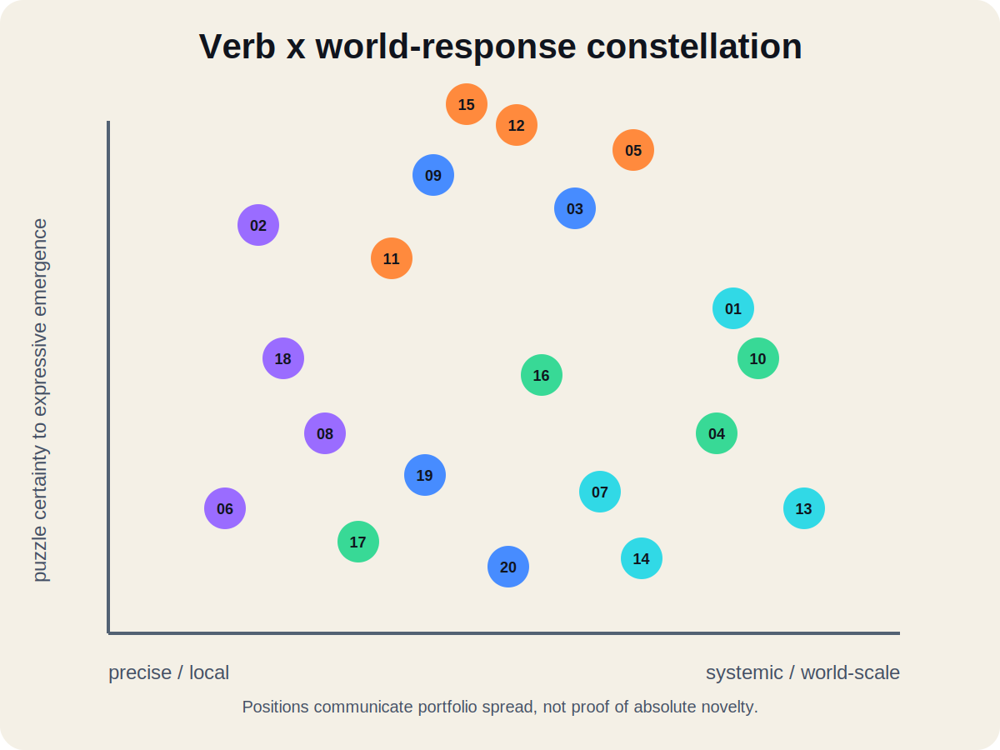
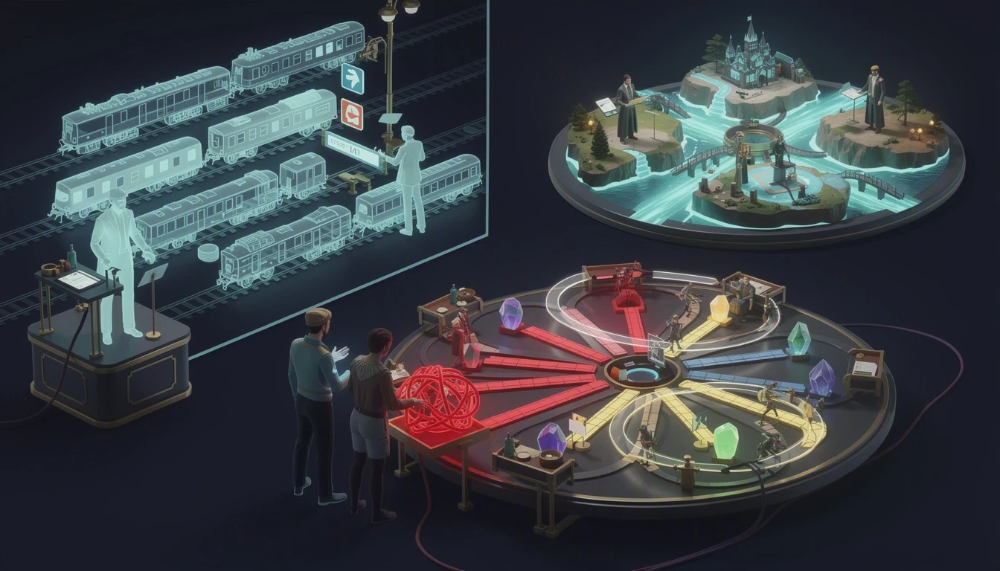
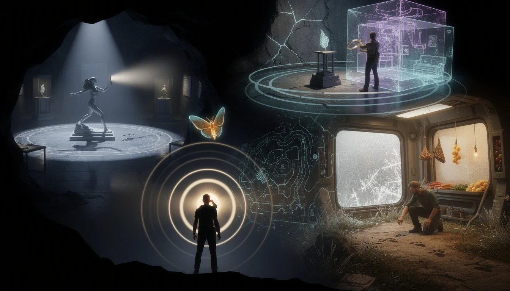
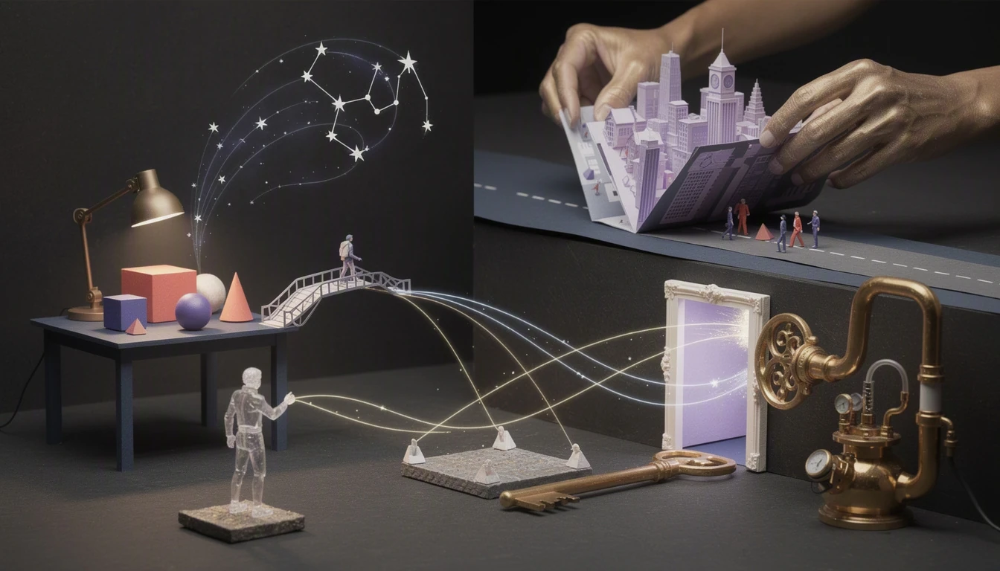
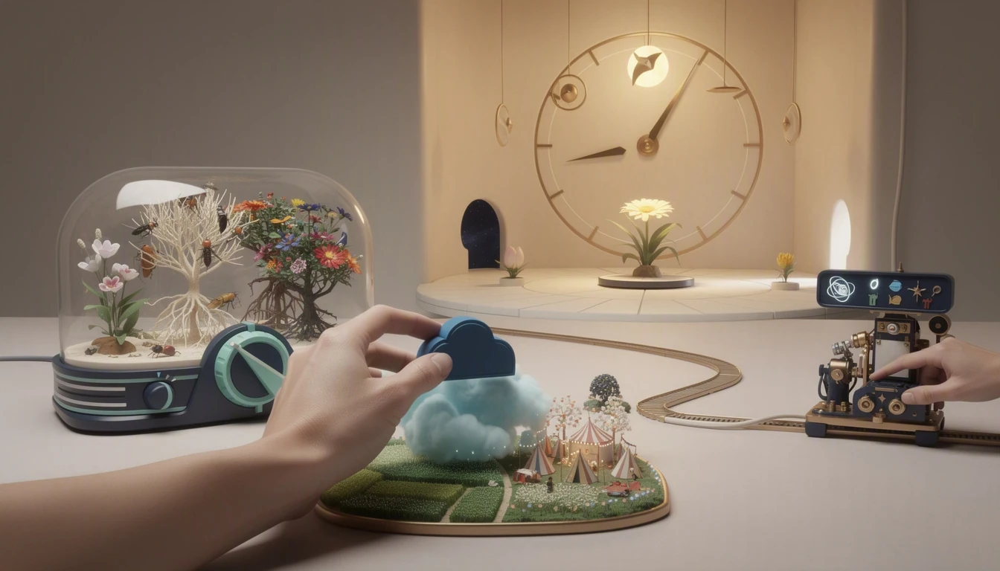
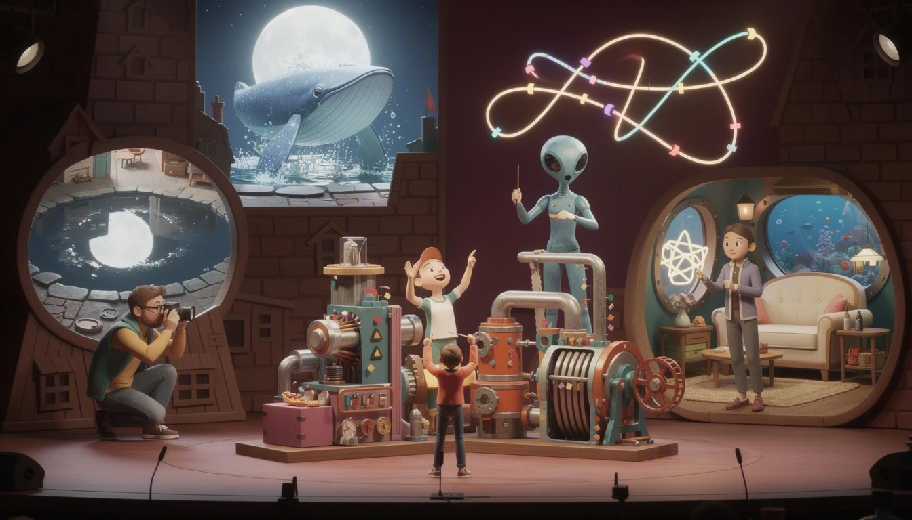
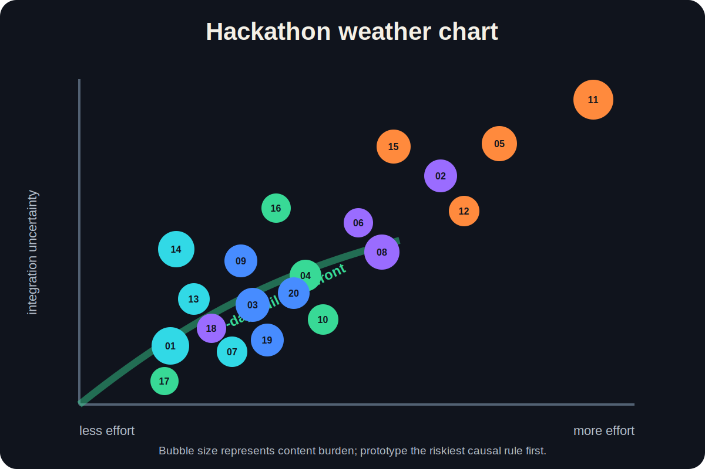
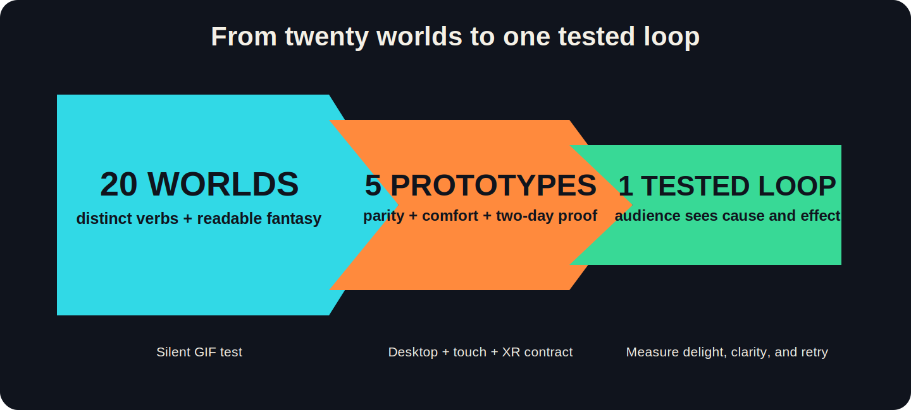

# Twenty worlds, one WebXR codebase

## Visual game proposals for desktop, mobile, and XR

Twenty sharply different game fantasies. One shared product promise: the same
meaningful decision works with a mouse, one-thumb touch, or an XR ray and grab.

**Selection lens:** readable in 20 seconds, satisfying in 3 minutes, seated-first,
and buildable as one polished hackathon loop.

|        20 concepts |         20 core verbs |     3 equal platforms | 5 generated visual plates |
| --------------: | --------------------: | --------------------: | ------------------------: |
| Differentiated worlds | Distinct interactions | Desktop + mobile + XR | Four concepts per plate |

### Executive read

- **Best event fit:** Loop Engineer turns agentic SDLC and SDLR into a tactile
  loop-engineering lesson with an employed NPC mentor.
- **Best spatial spectacles:** Gravity Loom, Shadowwright, Origami Rescue, and
  Size Thief make their rules visible as transformed space.
- **Safest compact systems:** Tiny Treaty Table, Ghostline Dispatcher,
  Invisible Zoo Keeper, and Second-Hand Sun use discrete, testable decisions.
- **Highest prototype-first risks:** Portal Paparazzi, Choir Engine, and Echo
  Cartographer depend on rendering, latency, or sensory presentation that must
  be proven early.
- **Originality language:** comparisons below come from bounded desk research.
  They identify useful neighbors and collision risks, not proof of novelty,
  legal clearance, or trademark availability.

# How to read the proposal

## The universal game loop

| 1. READ            | 2. CHOOSE                    | 3. ACT                        | 4. WORLD RESPONDS          | 5. LEARN               |
| ------------------ | ---------------------------- | ----------------------------- | -------------------------- | ---------------------- |
| See one clear need | Make one meaningful decision | Use the platform-native input | Watch space visibly change | Keep, undo, or improve |

`READ -> CHOOSE -> ACT -> WORLD RESPONDS -> LEARN -> READ`

## Three inputs, one consequence

| Platform lane | Native expression                          | Shared contract                                     |
| ------------- | ------------------------------------------ | --------------------------------------------------- |
| DESKTOP       | Click, drag, wheel, keys                   | Same verb, information, result, and ending          |
| MOBILE        | Tap-select, tap-place, large dials         | One-thumb path; no hover or precision drag required |
| XR            | Ray-select, direct grab, reachable gesture | Embodiment adds delight but never gates progress    |

## Card legend

| Mark               | Meaning                                                  |
| ------------------ | -------------------------------------------------------- |
| `WOW 1-5`          | How strongly one image or action sells the fantasy       |
| `FEAS 1-5`         | Hackathon feasibility, where 5 is safest                 |
| `ORIGINALITY RISK` | Market-similarity pressure, not creative quality         |
| `COMFORT`          | Default posture, motion model, and key mitigation        |
| `DIFFERENCE`       | The mechanic or framing that must survive implementation |

## Twenty-world atlas - locked order

| 01                  | 02                   | 03                   | 04                    | 05                   |
| ------------------- | -------------------- | -------------------- | --------------------- | -------------------- |
| Loop Engineer       | Echo Cartographer    | Gravity Loom         | Pocket Weather Bureau | Choir Engine         |
| 06                  | 07                   | 08                   | 09                    | 10                   |
| Museum of Stillness | Ghostline Dispatcher | Reverse Archaeology  | Shadowwright          | Minute Garden        |
| 11                  | 12                   | 13                   | 14                    | 15                   |
| Portal Paparazzi    | Gesture Linguist     | Tiny Treaty Table    | Dream Assembly Line   | The Unreliable Stage |
| 16                  | 17                   | 18                   | 19                    | 20                   |
| Message in a Moon   | Second-Hand Sun      | Invisible Zoo Keeper | Origami Rescue        | Size Thief           |

# Gallery 1 - Systems, agents, and social strategy

## 01 - Loop Engineer

> **Employ a mentor. Master the agent loop.**
>
> `DEFINE FEATURE -> PLAN + DELEGATE -> BUILD + TEST -> REVIEW + ITERATE`

- **Fantasy:** Employ an NPC who teaches agentic software development across
  SDLC and SDLR by turning one feature request into visible, repeatable loops.
- **Platforms:** Desktop drags role cards. Mobile uses tap-select and tap-place.
  XR places cards around a waist-high workbench and presses a physical Run pad.
- **Comfort:** Seated-first, no locomotion, no typing, captions, undo, and no
  evidence flying toward the face.
- **Difference:** The employee teaches the employer to carry a feature across
  the SDLC while using SDLR, bounded ownership, tests, feedback, and
  evidence-driven loops. It is not a worker-programming grid or a production
  agent dashboard.
- **Risk:** `WOW 5 | FEAS 5 | ORIGINALITY MEDIUM` - every card must produce a
  visible behavior change or the lesson becomes project-management sorting.
- **Terminology guardrail:** SDLC means the software development life cycle.
  SDLR remains the owner's framework term until its curriculum and expansion are
  supplied; this proposal does not invent an external definition for it.

## 07 - Ghostline Dispatcher

> **Schedule ghost trains across overlapping decades.**
>
> `READ PASSENGER -> CHOOSE ERA -> RESERVE CROSSING -> UNTANGLE TIME`

- **Platforms:** Click and drag timetable tokens; tap large route and era tabs;
  or place physical tokens and turn an XR era dial.
- **Comfort:** Fixed overview, no train-ride camera, reduced-motion schematic.
- **Difference:** A departure selects both a time slot and which station,
  obstruction, and passenger exist in that decade.
- **Risk:** `WOW 4 | FEAS 5 | ORIGINALITY MEDIUM` - introduce only one visible
  conflict at a time so it does not read as a dense transit spreadsheet.

## 13 - Tiny Treaty Table

> **Make promises that physically reshape the map.**
>
> `HEAR PETITIONS -> BUILD PROMISE -> PREVIEW COST -> ADVANCE SEASON`

- **Platforms:** Click or tap three large clauses; in XR, place beneficiary,
  resource, and duration tiles into a treaty frame.
- **Comfort:** Seated tabletop, snap rotation, no locomotion or time pressure.
- **Difference:** Diplomacy becomes persistent topology: promises rise as
  bridges, pipelines, borders, and taboos. Victory is coalition survival, not
  combat or conquest.
- **Risk:** `WOW 4 | FEAS 5 | ORIGINALITY LOW` - text density must collapse into
  readable icons and immediate map consequences.

## 14 - Dream Assembly Line

> **Program surreal dreams with readable if-then rules.**
>
> `READ REQUEST -> ORDER RULES -> TRACE MATCHES -> PATCH EXCEPTION`

- **Platforms:** Drag rules on desktop, tap slots and move arrows on mobile, or
  snap large rule blocks into an XR rack.
- **Comfort:** Stationary factory with step execution and moderate motion.
- **Difference:** Every surreal object exposes the exact rule that changed it.
  The focus is deterministic trait transformation, not agent delegation.
- **Risk:** `WOW 4 | FEAS 5 | ORIGINALITY HIGH` - avoid Loop Engineer's visual
  language and keep rule traces obvious enough to debug at a glance.

# Gallery 2 - Perception, evidence, and invisible worlds

## 02 - Echo Cartographer

> **Map darkness by triangulating visible echoes.**
>
> `PULSE -> PIN RETURNS -> INFER PASSAGE -> GUIDE MOTH`

- **Platforms:** Aim and click; drag and tap; or point an XR tuning wand and
  touch the returns. All modes pin the same surfaces and waypoints.
- **Comfort:** Static viewpoints, no required sound localization, visual rings,
  captions, and optional haptics.
- **Difference:** Multiple pulse positions become a temporary navigable map,
  then a route for a luminous moth. It is not only darkness revealed by sonar.
- **Risk:** `WOW 4 | FEAS 3 | ORIGINALITY MEDIUM` - visual timing must carry the
  complete mechanic when audio hardware is weak or unavailable.

## 06 - Museum of Stillness

> **Escape curators by becoming the perfect exhibit.**
>
> `STUDY POSES -> MOVE IN SHADOW -> IMPERSONATE ART -> REACH PLINTH`

- **Platforms:** Node movement and pose keys; touch destinations and pose cards;
  or optional body matching with a fully equivalent XR ray icon.
- **Comfort:** Seated pose set, broad tolerance, no crouching, no smooth motion.
- **Difference:** Stillness selects a social disguise. It neither freezes time
  nor requires athletic pose accuracy.
- **Risk:** `WOW 4 | FEAS 4 | ORIGINALITY MEDIUM` - physical recognition is
  flair only; the accessible icon path is canonical.

## 08 - Reverse Archaeology

> **Rewind artifacts to reconstruct their forgotten causes.**
>
> `INSPECT CLUE -> REWIND OBJECT -> PIN CAUSE -> TEST ROOM`

- **Platforms:** Wheel or slide local time; in XR, hold an artifact and turn a
  separate time ring. Every mode pins the same causal evidence.
- **Comfort:** Object-local motion, slow rewind, dissolve mode, stable camera.
- **Difference:** Rewinding one object's damage history rebuilds the surrounding
  causal story. It avoids whole-world rewind and identity-led corpse deduction.
- **Risk:** `WOW 4 | FEAS 3 | ORIGINALITY MEDIUM` - one dense evidence chain is
  safer than many shallow artifacts.

## 18 - Invisible Zoo Keeper

> **Care for creatures visible only through evidence.**
>
> `OBSERVE TRACES -> FORM HYPOTHESIS -> CHANGE HABITAT -> READ RESPONSE`

- **Platforms:** Click or tap traces and care cards; in XR, ray-scan evidence and
  place care tokens without touching the animal.
- **Comfort:** Fixed enclosure, optional snap rotation, captions, visual sound
  direction, and non-punitive mistakes.
- **Difference:** Discovery and welfare are one testable loop. Food, frost,
  footprints, and nesting behavior explain both identity and need.
- **Risk:** `WOW 4 | FEAS 5 | ORIGINALITY LOW` - the final luminous outline must
  reward the player without breaking the invisible-creature promise.

# Gallery 3 - Forces, shadows, folds, and scale

## 03 - Gravity Loom

> **Weave gravity threads into living constellations.**
>
> `READ TRAJECTORIES -> WEAVE THREADS -> RUN ORBIT -> STABILIZE SONG`

- **Platforms:** Click or tap anchor pairs and adjust tension; XR can pinch two
  anchors or use the same seated ray controls.
- **Comfort:** Fixed tabletop sky, no locomotion, slow bounded particles, and
  stepped prediction arcs in reduced-motion mode.
- **Difference:** Gravity is a temporary woven field used to compose stability,
  not a projectile launcher or unrestricted physics sandbox.
- **Risk:** `WOW 5 | FEAS 4 | ORIGINALITY LOW` - use authored force fields so
  every prediction remains deterministic across devices.

## 09 - Shadowwright

> **Build 3D sculptures that cast playable shadows.**
>
> `READ NEED -> COMPOSE FORMS -> PREVIEW SHADOW -> KEEP AFFORDANCE`

- **Platforms:** Rotate forms with mouse, visible touch controls, or direct and
  ray-based XR manipulation with one-handed handles.
- **Comfort:** Fixed bench, no locomotion, outline mode, and non-shadow preview.
- **Difference:** The shadow becomes a persistent functional bridge, shelter,
  or prop for a living projected character, not merely a target silhouette.
- **Risk:** `WOW 5 | FEAS 4 | ORIGINALITY MEDIUM` - broad authored anchor regions
  are safer than exact pixel scoring.

## 19 - Origami Rescue

> **Fold distant places together to rescue citizens.**
>
> `READ ROUTES -> PREVIEW CREASE -> FOLD AND PIN -> RUN PATHS`

- **Platforms:** Drag a fold angle, use a large touch slider, or lift a reachable
  crease handle in XR with a one-handed ray fallback.
- **Comfort:** Seated tabletop, slow authored folds, no head intersections, and
  stepped states for reduced motion.
- **Difference:** Legal creases rewrite a rescue path graph and finish as a
  commemorative route pattern. The target is topology, not folded imagery.
- **Risk:** `WOW 5 | FEAS 4 | ORIGINALITY MEDIUM` - rigid hinged panels and a
  small connectivity graph avoid deformable-paper scope.

## 20 - Size Thief

> **Steal size from objects to change their purpose.**
>
> `READ THRESHOLDS -> LINK PAIR -> TRANSFER SIZE -> REBALANCE EXIT`

- **Platforms:** Select donor and receiver, then use a wheel, touch slider, or XR
  pump handle to move the same measured resource.
- **Comfort:** Fixed room or miniature; gradual object scaling; never scale the
  player camera or the whole world.
- **Difference:** Total size is conserved. Making a door useful necessarily
  shrinks something else past its own functional threshold.
- **Risk:** `WOW 5 | FEAS 4 | ORIGINALITY HIGH` - authored scale tiers must make
  the conservation rule more visible than familiar perspective puzzles.

# Gallery 4 - Weather, ecology, light, and inherited cycles

## 04 - Pocket Weather Bureau

> **Forecast one island's beautiful impossible compromise.**
>
> `READ NEEDS -> DRAW FRONT -> ADVANCE WEATHER -> COMPARE FORECAST`

- **Platforms:** Draw pressure paths with mouse, finger, or XR ray; adjust one
  large strength dial and advance the same forecast clock.
- **Comfort:** Static island, gentle time-lapse, contour-based reduced motion.
- **Difference:** The player is judged on prediction accuracy and transparent
  tradeoffs between communities, not freeform decoration or perfect weather.
- **Risk:** `WOW 4 | FEAS 4 | ORIGINALITY MEDIUM` - arrows, contours, and numbers
  must make the simplified simulation feel accountable rather than arbitrary.

## 10 - Minute Garden

> **Guide centuries with one change per generation.**
>
> `READ EVENT -> CHANGE ONE CONDITION -> ADVANCE GENERATION -> SAVE LINEAGE`

- **Platforms:** Click or tap plots and large dials; XR uses the same terrarium
  controls as reachable physical knobs.
- **Comfort:** Static view, stepped time, no flicker, no near-face swarms.
- **Difference:** One intervention per generation asks the player to steer
  resilience and diversity instead of directly planting an optimal garden.
- **Risk:** `WOW 4 | FEAS 4 | ORIGINALITY MEDIUM` - causal arrows must explain
  why each trait changed across centuries.

## 16 - Message in a Moon

> **Inherit, repair, and relay a tiny moon.**
>
> `DECODE SEQUENCE -> REPAIR BEAT -> COMPOSE INTENT -> PASS SEED`

- **Platforms:** Edit timeline cells, tap reorder arrows, or place light, orbit,
  and chime tokens around the moon in XR.
- **Comfort:** Fixed diorama, slow bounded orbit, schematic reduced-motion mode.
- **Difference:** The artifact itself carries a constrained asynchronous
  conversation and visible lineage instead of a text or drawing message.
- **Risk:** `WOW 4 | FEAS 4 | ORIGINALITY LOW` - use local storage or share codes
  for the demo; a public relay would add moderation and backend scope.

## 17 - Second-Hand Sun

> **Schedule sunlight to unlock one impossible room.**
>
> `INSPECT WINDOWS -> SET CLOCK -> PIN STATE -> COMBINE LIGHT`

- **Platforms:** Drag clock hands, use a large touch dial, or turn reachable XR
  handles. Memory pins remain identical across modes.
- **Comfort:** Fixed room, slow light presets, no flashing or camera motion.
- **Difference:** Time is a scheduled lighting resource and scarce states can be
  pinned. It is not a rewind or recorded-clone mechanic.
- **Risk:** `WOW 4 | FEAS 5 | ORIGINALITY MEDIUM` - authored material and shadow
  presets are safer than fully dynamic lighting.

# Gallery 5 - Music, photography, language, and improvisation

## 05 - Choir Engine

> **Conduct a factory until machinery finds harmony.**
>
> `HEAR REQUEST -> CUE SECTIONS -> REPAIR SYNC -> LAND CADENCE`

- **Platforms:** Mouse or key cues, large mobile pads and swipes, or an XR baton
  with accessible ray buttons for every gesture.
- **Comfort:** No locomotion, one-handed mode, wide timing windows, visual beat
  lane, captions, and haptics.
- **Difference:** Conducting schedules when machine sections enter, hold, and
  cut. There are no incoming hit targets or freely programmed conveyors.
- **Risk:** `WOW 5 | FEAS 3 | ORIGINALITY MEDIUM` - calibrate latency early and
  let musical failure thin the arrangement instead of stopping play.

## 11 - Portal Paparazzi

> **Frame impossible spaces into one perfect photograph.**
>
> `READ BRIEF -> CHOOSE VANTAGE -> ALIGN SPACES -> CAPTURE BEAT`

- **Platforms:** Mouse camera and shutter, touch camera with optional gyro, or a
  stable XR viewfinder at fixed tripods.
- **Comfort:** Teleport or instant vantage changes, no forced zoom, no camera
  animation, and gyro off by default.
- **Difference:** Separate places become briefly contiguous inside a camera
  frame so a celebrity creature can perform an impossible event.
- **Risk:** `WOW 5 | FEAS 2 | ORIGINALITY HIGH` - prototype portal rendering and
  composition scoring first; fake depth with a second camera plane if needed.

## 12 - Gesture Linguist

> **Speak an alien language drawn through space.**
>
> `OBSERVE CONTEXT -> INFER RULE -> TRACE REPLY -> CORRECT DIMENSION`

- **Platforms:** Mouse stroke plus depth wheel, layered touch drawing, or a
  reachable XR tracing panel with controller or hand ray.
- **Comfort:** No locomotion, one-handed mode, traces below eye level, broad
  matching, and no microphone requirement.
- **Difference:** Direction, depth, tempo, and distance form grammar that the
  alien acts out. It is not symbol substitution or precision motion scoring.
- **Risk:** `WOW 4 | FEAS 3 | ORIGINALITY MEDIUM` - show which semantic dimension
  was understood so mistakes feel comic rather than arbitrary.

## 15 - The Unreliable Stage

> **Improvise while the world changes the genre.**
>
> `ACCEPT ROLE -> CHOOSE RESPONSE -> SURVIVE FLIP -> KEEP ONE FACT`

- **Platforms:** Response keys and mouse flourishes, touch cards and swipes, or
  XR ray choices with optional reachable gestures.
- **Comfort:** Stable floor, no locomotion, scenery crossfades, seated director
  mode, and no required speech.
- **Difference:** The player preserves one story fact while genre, scenery, and
  emotional objective mutate. Scoring favors recovery and callbacks.
- **Risk:** `WOW 5 | FEAS 4 | ORIGINALITY MEDIUM` - keep one authored story spine
  so combinatorial performance does not become a content explosion.

# Five-concept hackathon shortlist

| Rank | Concept                  | Why prototype it                                                    | Smallest lovable proof                                     | Watch first                                           |
| ---: | ------------------------ | ------------------------------------------------------------------- | ---------------------------------------------------------- | ----------------------------------------------------- |
|    1 | **Loop Engineer**        | Strongest event relevance, teaching value, and visible before-after | One bad run, one evidence review, one corrected run        | Does every orchestration choice visibly matter?       |
|    2 | **Gravity Loom**         | Best clean spatial spectacle with low similarity pressure           | Two thread placements create one singing constellation     | Are paths deterministic and understandable?           |
|    3 | **Tiny Treaty Table**    | Safest social strategy loop and strongest tabletop parity           | One promise helps a nation and visibly harms another       | Can icon-only clauses stay readable?                  |
|    4 | **Origami Rescue**       | Immediate XR delight that still maps cleanly to touch               | One crease joins two regions and saves one citizen         | Can rigid panels sell the fold illusion?              |
|    5 | **Invisible Zoo Keeper** | Unusual, accessible deduction-care loop with modest tech risk       | Three traces identify one need and earn one outline reveal | Is caring for an unseen animal emotionally rewarding? |

## Decision map

| If the team wants...              | Start with...        | Keep as backup...    |
| --------------------------------- | -------------------- | -------------------- |
| AI-native edutainment             | Loop Engineer        | Dream Assembly Line  |
| Immediate spatial magic           | Gravity Loom         | Shadowwright         |
| Character and social consequences | Tiny Treaty Table    | The Unreliable Stage |
| Tactile XR transformation         | Origami Rescue       | Size Thief           |
| Calm mystery and broad access     | Invisible Zoo Keeper | Reverse Archaeology  |

## Originality and market caution

This proposal uses careful, relative language: **low**, **medium**, and **high**
describe similarity pressure found in a bounded scan of current storefronts,
known games, WebXR directories, and research references. They are not claims
that no similar jam game, prototype, patent, unpublished project, or regional
release exists. Before selecting a finalist, repeat searches using the final
title, one-sentence mechanic, and key art; run trademark, domain, and legal
checks separately.

### Selected research links

- Platform context: [W3C WebXR Device API](https://www.w3.org/TR/webxr/),
  [Immersive Web samples](https://immersive-web.github.io/webxr-samples/), and
  [WebXR Directory](https://webxr.directory/).
- Loop Engineer neighbors: [Human Resource Machine](https://tomorrowcorporation.com/humanresourcemachine),
  [7 Billion Humans](https://tomorrowcorporation.com/7billionhumans), and
  [while True: learn()](https://store.steampowered.com/app/619150/while_True_learn/).
- Perception and deduction: [Scanner Sombre](https://www.introversion.co.uk/scannersombre/),
  [Return of the Obra Dinn](https://obradinn.com/), and
  [Strange Horticulture](https://strangehorticulture.com/).
- Spatial construction: [Shadowmatic](https://www.shadowmatic.com/),
  [Paper Trail](https://papertrailgame.com/), and
  [Superliminal](https://www.pillowcastlegames.com/superliminal).
- Systems and performance: [Mini Metro](https://dinopoloclub.com/games/mini-metro/),
  [Maestro](https://maestrothegame.com/),
  [Chants of Sennaar](https://www.focus-entmt.com/en/games/chants-of-sennaar),
  and [The Under Presents](https://tenderclaws.com/theunderpresents).
- Perspective and tabletop references: [Viewfinder](https://www.sos.games/viewfinder),
  [Demeo](https://www.resolutiongames.com/demeo),
  [Townscaper](https://store.steampowered.com/app/1291340/Townscaper/), and
  [The Room VR](https://www.fireproofgames.com/games/the-room-vr-a-dark-matter).

## Recommendation

Prototype **Loop Engineer** first if the goal is to teach agentic software
development across SDLC and SDLR using loop engineering. In parallel, keep
**Gravity Loom** as the low-text, high-spectacle fallback. Both can prove their
central promise with one room, one visible loop, no backend, and no required
locomotion.

## Free asset starter kits

The interactive gallery at `public/designs/index.html` includes a verified
primary and supporting free pack for every concept. The structured source is
`asset-recommendations.json`; detailed fit, format, optimization, and custom-work
notes live in the three `plans/game-concept-proposals/agent-notes/assets-*.md`
research files.

| # | Concept | Primary free pack | Supporting pack |
| ---: | --- | --- | --- |
| 01 | Loop Engineer | Quaternius Ultimate Modular Sci-Fi Pack | Quaternius Ultimate Animated Character Pack |
| 02 | Echo Cartographer | Kenney Modular Cave Kit | Quaternius Ultimate Stylized Nature Pack |
| 03 | Gravity Loom | Quaternius Ultimate Space Kit | Kenney Space Kit |
| 04 | Pocket Weather Bureau | Quaternius Ultimate Nature Pack | Quaternius Modular Platformer Pack |
| 05 | Choir Engine | Kenney Factory Kit | iPoly3D Concert Pack on Poly Pizza |
| 06 | Museum of Stillness | Quaternius Background Posed Humans Pack | Kenney Furniture Kit |
| 07 | Ghostline Dispatcher | Quaternius Modular Train Pack | Kenney Train Kit |
| 08 | Reverse Archaeology | Quaternius Ultimate Modular Ruins Pack | Quaternius Fantasy Props MegaKit (free Standard subset) |
| 09 | Shadowwright | Quaternius Platformer Game Kit | Kenney Prototype Kit |
| 10 | Minute Garden | Quaternius Stylized Nature MegaKit (free Standard subset) | Quaternius Ultimate Crops Pack |
| 11 | Portal Paparazzi | Quaternius Downtown City MegaKit (free Standard subset) | Quaternius Ultimate Monsters |
| 12 | Gesture Linguist | Quaternius Animated Alien Pack | Quaternius Universal Animation Library (free Standard subset; verify desired clips) |
| 13 | Tiny Treaty Table | Quaternius Ultimate Fantasy RTS | Quaternius 3D Card Kit - Fantasy (free Standard subset) |
| 14 | Dream Assembly Line | Kenney Factory Kit | Quaternius Sci-Fi Essentials Kit (free Standard subset) |
| 15 | The Unreliable Stage | Quaternius Ultimate Animated Character Pack | Quaternius Ultimate House Interior Pack |
| 16 | Message in a Moon | Quaternius Ultimate Space Kit | Quaternius Ultimate Modular Sci-Fi Pack |
| 17 | Second-Hand Sun | Quaternius Ultimate House Interior Pack | Quaternius Ultimate Stylized Nature Pack |
| 18 | Invisible Zoo Keeper | Quaternius Ultimate Animated Animal Pack | Quaternius Ultimate Stylized Nature Pack |
| 19 | Origami Rescue | Quaternius Modular Streets Pack | Quaternius Ultimate Buildings Pack |
| 20 | Size Thief | Quaternius Ultimate House Interior Pack | Kenney Furniture Kit |

Quaternius and Kenney selections are CC0 on their official pages. Six named
Quaternius products above provide a free Standard subset while their complete
Pro/Source catalog is paid; do not assume an item from the full catalog is in
the free archive. The listed Poly Pizza bundle is also explicitly CC0, but Poly
Pizza licensing otherwise varies by model. Recheck and archive each downloaded
license when importing an asset, convert selected models to GLB as needed, and
ship only the small subset used by the vertical slice.
