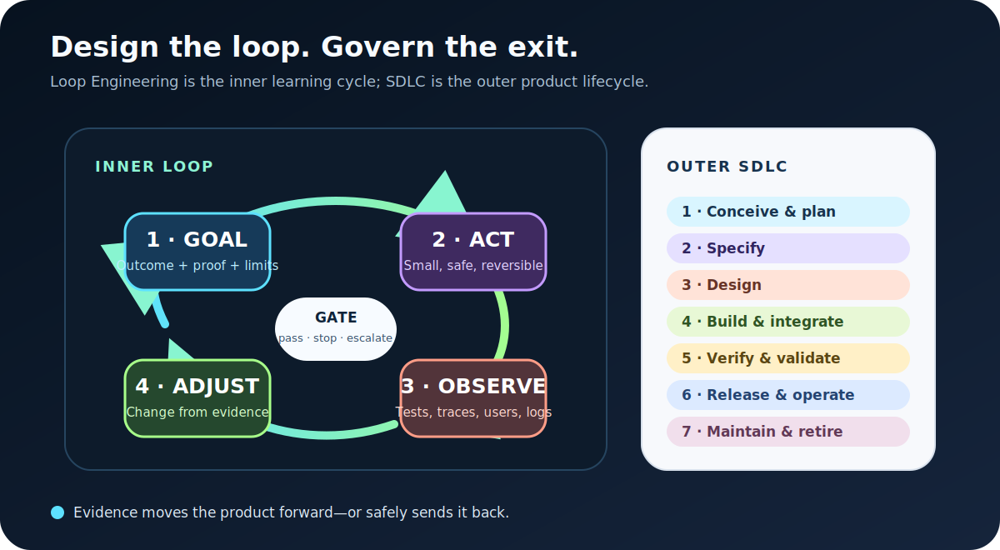
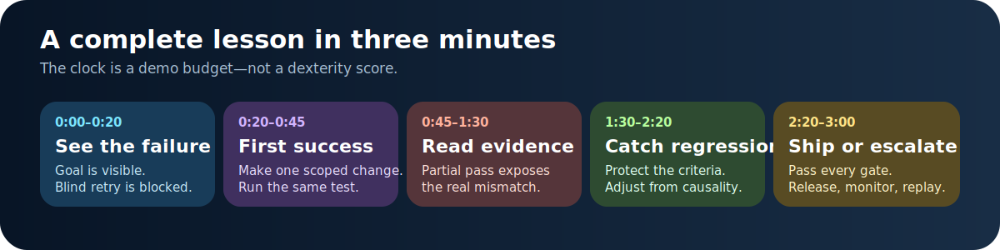
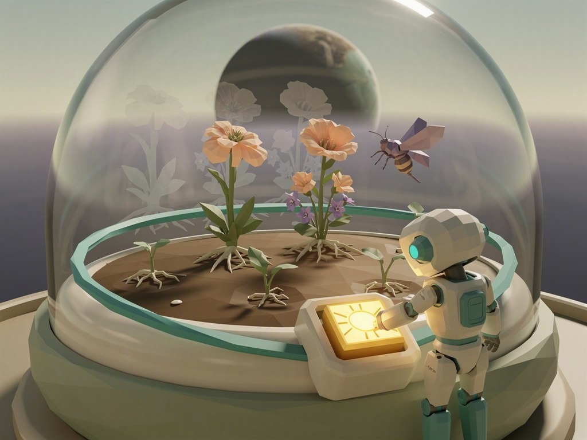
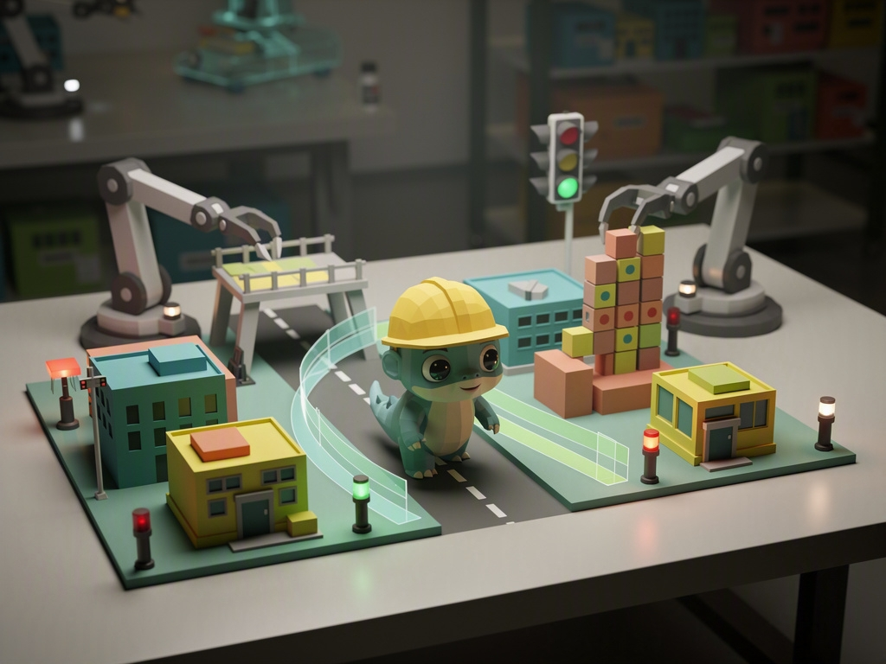
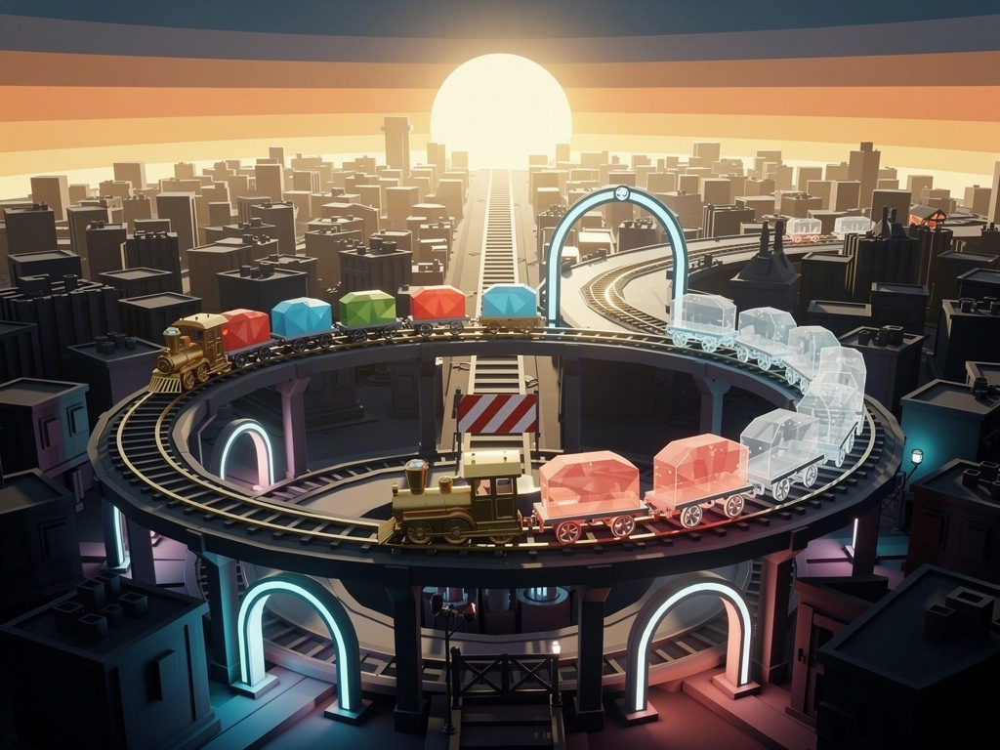
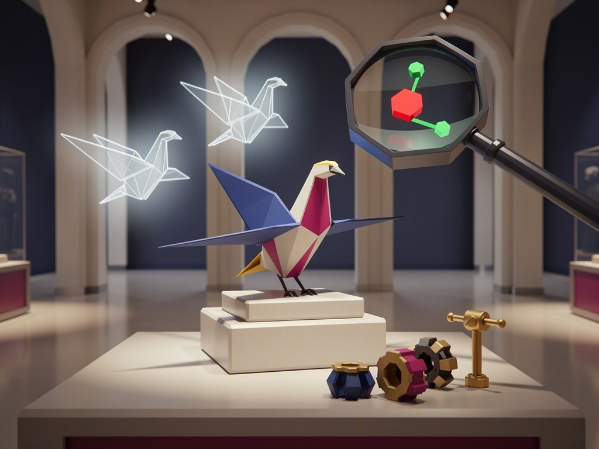
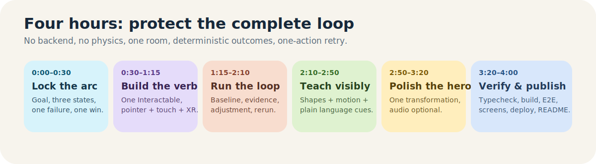

# Loop Engineer — five WebXR game proposals

**Decision document · July 20, 2026**  
**Target:** OpenAI Build Week, Education track  
**Build constraint:** one polished 180-second game, one codebase, four focused implementation hours  
**Recommended first choice:** **Kaiju QA**  
**Recommended backup:** **The Museum of Almosts**

> **Shared promise:** Make one bounded change, read the evidence, and earn the right to ship.

## The lesson all five games teach

“Loop Engineering” is an emerging 2026 practitioner term, not an ISO-standard
process or a synonym for a programming loop. For this game, it means:

> **Design and govern a recurring workflow in which an agent takes bounded
> action, obtains environment-grounded evidence, and adjusts or exits under
> explicit success, risk, budget, and human-authority conditions.**

The player learns one memorable inner loop:

1. **Goal** — define the outcome, acceptance evidence, limits, and authority.
2. **Act** — make the smallest safe, reversible change.
3. **Observe** — read tests, traces, users, telemetry, or review; never trust only
   the actor saying “done.”
4. **Adjust** — change the plan or implementation from evidence.
5. **Gate** — pass, repeat, stop, roll back, or escalate.

That loop can run inside every SDLC phase: conceive, specify, design, build,
verify, release/operate, and maintain/retire. The game does not teach “keep
trying.” It teaches **change conditionally, preserve the quality bar, and stop
responsibly**.

## Five directions at a glance

Paper scores use the repository's weighted concept matrix and are directional,
not substitutes for a graybox playtest.

| Concept | Core verb | Spatial evidence | Dominant feeling | Paper score | Best reason to choose it |
| --- | --- | --- | --- | ---: | --- |
| **Stormglass** | Align prisms | Lightning route traces | Urgency → relief | 87 | Cinematic rescue with a very legible before/after |
| **The Tomorrow Garden** | Cultivate one variable | Prior seasons as plant silhouettes | Calm mastery | 84 | Gentle, memorable systems-thinking lesson |
| **Kaiju QA** | Stage test scenarios | Damage paths and coverage props | Comedy → confidence | **92** | Fastest judge comprehension and strongest GIF moment |
| **Sunrise Express** | Route a rehearsal | Ghost trains and dependency stops | Momentum → triumph | 86 | Makes release gates and integration tangible |
| **The Museum of Almosts** | Inspect and compare | Layered prototype differences | Mystery → wonder | **89** | Most original, elegant expression of evidence and retrospectives |

### Auditable paper-score matrix

Each criterion uses a whole-number score from 1 to 5. The weighted contribution
is `(score ÷ 5) × weight`; totals below have no hidden risk penalty.

| Concept | Comprehension /15 | Core verb /15 | Arc /15 | Build /20 | Parity /10 | XR /10 | Demo /10 | Energy /5 | Total |
| --- | ---: | ---: | ---: | ---: | ---: | ---: | ---: | ---: | ---: |
| Stormglass | 4 | 4 | 5 | 4 | 4 | 5 | 5 | 4 | 87 |
| The Tomorrow Garden | 4 | 4 | 5 | 4 | 5 | 4 | 4 | 3 | 84 |
| Kaiju QA | 5 | 4 | 5 | 5 | 4 | 4 | 5 | 4 | **92** |
| Sunrise Express | 4 | 5 | 4 | 5 | 4 | 4 | 4 | 3 | 86 |
| The Museum of Almosts | 4 | 4 | 5 | 4 | 5 | 5 | 5 | 4 | **89** |

The matrix favors Kaiju QA for comprehension and delivery certainty, while
Museum of Almosts leads on spatial/XR originality after its lens interaction is
reduced to discrete compare positions.

## 1. Loop Engineer: Stormglass

**One-line pitch:** Rotate the prisms of a sky-lighthouse, run repeatable storm
tests, and use lightning traces to open one verified route for a courier
airship.

**Why it is different:** This is a rescue-and-calibration game, not a circuit
board. The evidence fills the sky: each attempt leaves a spatial route trace,
and the player changes one optical variable instead of reconnecting nodes.

### The 180-second player loop

| Beat | Player action | Teaching payload |
| --- | --- | --- |
| 0:00–0:20 | Pull the test lever; the courier's route collapses in a visible crosswind. | A visible goal and deterministic baseline come before a fix. |
| 0:20–0:45 | Rotate one inviting prism; the nearest cloud ring clears. | Make one bounded change and rerun the same test. |
| 0:45–1:30 | A second criterion reveals that the fast route overloads the lighthouse. | Partial success is not acceptance; inspect all evidence. |
| 1:30–2:20 | Compare route ghosts and choose a longer robust path or a tighter risky one. | Adjust from causality, constraints, and risk—not aesthetics. |
| 2:20–3:00 | Pass the repeated test, commit the route, and watch the courier fly through. | Release only after the gate passes; retain the alternate for replay. |

**Cross-platform contract:** select one of three discrete prism orientations by
drag-and-snap or select-to-cycle; press one large test/commit control. No
locomotion, continuous precision rotation, or two-handed action.

**Four-hour scope floor:** one circular table, two required prism entities, three
preauthored route curves, two criteria, two attempts, one airship animation, one
reset. A third prism is polish only. Stylized cloud cards or particles replace
volumetric weather.

**Free asset candidates:** Quaternius Ships, Fantasy Props MegaKit, Ultimate
Modular Ruins, and Ultimate Stylized Nature; all candidates remain subject to
the source/license verification in ASSET_PLAN.md.

**Devpost strength:** a coherent three-minute story and spectacular release
moment. **Risk:** weather VFX can consume the schedule; if the first 30-minute
spike cannot make route evidence readable, cut to luminous ribbon paths over
layered cloud meshes.

## 2. Loop Engineer: The Tomorrow Garden

**One-line pitch:** Run accelerated seasons in a seedship terrarium, compare the
living evidence left by each cycle, and cultivate a habitat that can sustain
itself after release.

**Why it is different:** The system is grown rather than assembled. The core
choice is a careful intervention—light, water, pruning, or pollination—followed
by observation of dependencies across time.

### The 180-second player loop

| Beat | Player action | Teaching payload |
| --- | --- | --- |
| 0:00–0:20 | Run the inherited care plan; a sprout grows but cannot reproduce. | Existing work is a baseline, not a blank slate. |
| 0:20–0:45 | Add one missing sun tile and run another season. | A scoped change creates a clear first success. |
| 0:45–1:30 | Pollinators awaken; extra water helps one plant but floods another. | New requirements expose dependencies and regression. |
| 1:30–2:20 | Overlay prior gardens, prune one branch, and rebalance one input. | Attempt history is memory; evidence guides adjustment. |
| 2:20–3:00 | A full season runs without intervention; the ark pod seals at dawn. | Stability under repeat evidence earns release. |

**Cross-platform contract:** drag one large care token, tap/ray a plant to prune
or inspect, then press “run season.” XR adds scale and depth but not extra rules.

**Four-hour scope floor:** one circular planter, three plant meshes whose
scale/material/state changes deterministically, three required tokens, one prior
result overlay, one pollinator path, one seal animation. No procedural growth
simulation.

**Free asset candidates:** Quaternius Ultimate Crops, Stylized Nature MegaKit,
Simple Nature, Ultimate Nature, and Animated Robot.

**Devpost strength:** an unusually gentle way to teach systems feedback and
post-release stability. **Risk:** it can resemble generic resource balancing;
protect the visible hypothesis, attempt overlays, unchanged-retry warning, and
release gate.

## 3. Loop Engineer: Kaiju QA — recommended

**One-line pitch:** Before a helpful baby kaiju is deployed to a real city,
build a tabletop test district, stage edge cases, and prove that its “help
everyone” behavior is safe enough to ship.

**Why it is different:** The player does not fight, feed, or program the kaiju.
They are the quality engineer. Test coverage becomes a playful miniature city,
and broad “fixes” can create visible regressions.

### The 180-second player loop

| Beat | Player action | Teaching payload |
| --- | --- | --- |
| 0:00–0:20 | Run the empty test street; the kaiju carries a stalled car and earns a partial pass. | A happy path does not prove production readiness. |
| 0:20–0:45 | Place a fragile tower test; the same helpful behavior knocks it over. | Add an observable edge case before changing behavior. |
| 0:45–1:30 | Authorize a broad “freeze near buildings” guardrail; the tower passes, but an ambulance is blocked. | Overfitting one test can cause regression. |
| 1:30–2:20 | Compare both paths and place a targeted slow-zone boundary. | Preserve criteria and make the least-risk change. |
| 2:20–3:00 | Run all scenarios, stamp release, and watch the tiny kaiju become a city guardian. | Coverage + regression evidence earns the ship decision. |

**Cross-platform contract:** drag one scenario prop or boundary into a generous
socket; tap/ray the kaiju path to inspect evidence; press one run/release button.
The simulation is deterministic animation, not physics.

**Four-hour scope floor:** one tabletop, four simple buildings, one kaiju with
idle/walk/carry animations or state poses, two scenario props, three recorded
paths, red/green shape-coded evidence, one scale-up hero animation.

**Free asset candidates:** Quaternius Ultimate Monsters or Cute Monsters,
Simple Buildings or Downtown City Mega Kit, Cars, Turret Pack for test fixtures,
and Animated Robot for lab dressing.

**Devpost strength:** the mechanic is understandable in seconds, the regression
is funny without humiliating the player, and the hero shot communicates testing
without reading. It directly supports all four judging criteria: non-trivial
state/testing code, coherent design, practical education impact, and a novel
quality-engineering fantasy.

**Primary risk:** any destruction physics will break the four-hour plan. Keep
every outcome authored, reversible, and inspectable. **Kill condition:** if the
kaiju silhouette and the failed tower scenario are not readable in a 30-minute
graybox, switch to Museum of Almosts.

## 4. Loop Engineer: Sunrise Express

**One-line pitch:** Rehearse a magical release train across an orbital
switchyard, diagnose where its dependencies stop, and dispatch a verified
sunrise to the city below.

**Why it is different:** The train is the release artifact, not a logistics
economy. The player sees integration order, quality gates, rollback, and
operation as one civic ritual.

### The 180-second player loop

| Beat | Player action | Teaching payload |
| --- | --- | --- |
| 0:00–0:20 | Run a rehearsal; the light car reaches one district but the full train stops. | Baseline evidence identifies the first unmet dependency. |
| 0:20–0:45 | Flip one large switch; two cars pass the next inspection arch. | Small routing change, same repeatable test. |
| 0:45–1:30 | A shortcut reaches release faster but leaves the color car unverified. | Speed is not the only quality dimension. |
| 1:30–2:20 | Read the suspended ghost route and choose a robust or tight plan. | Integration decisions combine evidence, risk, and constraints. |
| 2:20–3:00 | Dispatch the full train; its wake lights the city, then a monitor light confirms operation. | Release is followed by observation, not “project done.” |

**Cross-platform contract:** click/tap/ray to toggle large switches and rotate
one gate; press rehearsal or dispatch. The entire yard is a fixed tabletop.

**Four-hour scope floor:** one circular track, five switchable route segments,
one train with colored cars, at most two retained route traces, three gate
states, one city material transition. No rail editor, passengers, schedules, or
physics.

**Free asset candidates:** Quaternius Modular Train, Public Transport, Simple
Buildings, Modular Streets, and Buildings.

**Devpost strength:** a powerful deployment metaphor and a clear climax.
**Risk:** route puzzles are familiar. Keep quality criteria, attempt history,
regression, and post-release monitoring visible; never score throughput or
minimum track length.

## 5. Loop Engineer: The Museum of Almosts — backup

**One-line pitch:** Restore an unfinished kinetic exhibit by comparing layered
prototypes, finding the shared mismatch, and preserving every useful failure in
the final verified story.

**Why it is different:** The evidence itself is the toy. The player moves an
inspection lens through translucent versions of one artifact, changes one
component, and turns the same test crank.

### The 180-second player loop

| Beat | Player action | Teaching payload |
| --- | --- | --- |
| 0:00–0:20 | Turn the crank; a paper bird forms only one wing. | Run the baseline before diagnosing. |
| 0:20–0:45 | Use the lens to align the expected silhouette and replace one worn part. | Compare actual with acceptance evidence. |
| 0:45–1:30 | The bird gains a wing but cannot fly; another prototype reveals a shared assumption. | A partial pass narrows the next hypothesis. |
| 1:30–2:20 | Overlay attempts and choose the component that fixes the cause without erasing prior gains. | Diff, regression protection, and cumulative memory. |
| 2:20–3:00 | The bird flies; the gallery becomes the makers' workshop and displays the attempt history. | A retrospective turns failure into reusable knowledge. |

**Cross-platform contract:** snap one inspection lens among discrete compare
positions—or toggle a side-by-side Compare view—select one replacement part,
and press one test crank. Continuous 6DoF alignment is not required. XR direct
grab is optional; ray, mouse, and touch remain equivalent.

**Four-hour scope floor:** one plinth, one origami-style bird with three poses,
at most two visible reference results, one discrete-position lens or Compare
toggle, three replacement parts, one test crank, one gallery-light
transformation.

**Free asset candidates:** Quaternius Furniture, Ultimate Furniture, Fantasy
Props MegaKit, and primitive geometry for the hero bird.

**Devpost strength:** the strongest originality story and most honest
representation of evidence, diffs, and retrospectives. **Risk:** the objective
may be too abstract. The first failure, expected silhouette, and matching
replacement socket must be readable without narration in the first 20 seconds.

## Recommendation

Choose **Kaiju QA** if the goal is the best chance of a legible, funny, complete
judged demo in four hours. It has the lowest explanation burden, the clearest
regression beat, and a hero moment that works in a screenshot, video, desktop,
touch, and XR.

Choose **The Museum of Almosts** if the team prefers a more elegant,
emotionally resonant concept and can validate the inspection lens in a
30-minute graybox.

Keep **Stormglass** as the cinematic alternative, **Sunrise Express** as the
deployment-focused alternative, and **The Tomorrow Garden** as the calm,
systems-thinking alternative.

## Scope rules shared by the winner

- One room or tabletop; no continuous locomotion.
- One satisfying semantic verb plus run/retry/release.
- Deterministic outcomes; no live model or backend on the critical path.
- No physics requirement. Simulate destruction, growth, routes, and traces.
- Goal within 20 seconds; first useful result within 45 seconds; clear ending
  before three minutes.
- Every essential state uses shape, motion, and short language—not color or
  audio alone.
- One-handed play, large targets, visible focus, captions, reduced-motion mode,
  and one-action retry.
- A world-space goal/result board plus Run, Retry, Commit/Release, Reset, and
  Recenter controls for headset users.
- Pause and resume one legal attempt across page blur, XR exit, and XR re-entry
  without duplicated timers, entities, traces, or input locks.
- Asset packs are optional accelerators. Primitive graybox geometry must remain
  a complete fallback.

## Research basis

- OpenAI Build Week overview and official rules, accessed 2026-07-20:
  <https://openai.devpost.com/> and <https://openai.devpost.com/rules>
- IBM, “What Is Loop Engineering?”, 2026-07-17:
  <https://www.ibm.com/think/topics/loop-engineering>
- Addy Osmani, “Beyond Prompt Engineering: The Rise of Context Engineering &
  Loop Engineering,” 2026-06-07:
  <https://addyosmani.com/blog/loop-engineering/>
- OpenAI, “Unrolling the Codex agent loop,” 2026-01-23:
  <https://openai.com/index/unrolling-the-codex-agent-loop/>
- OpenAI, “Harness engineering: leveraging Codex in an agent-first world,”
  2026-02-11: <https://openai.com/index/harness-engineering/>
- ISO/IEC/IEEE 12207:2026:
  <https://www.iso.org/standard/90219.html>
- NIST SP 800-218, Secure Software Development Framework:
  <https://csrc.nist.gov/pubs/sp/800/218/final>
- Comparable-game scan:
  plans/loop-engineer-concepts/agent-notes/market-research.md

Generated images are visual proposals, not final gameplay screenshots. They
were produced with Azure FLUX.2-pro from the prompts recorded in
AZURE_FLUX_PROMPTS.md.
