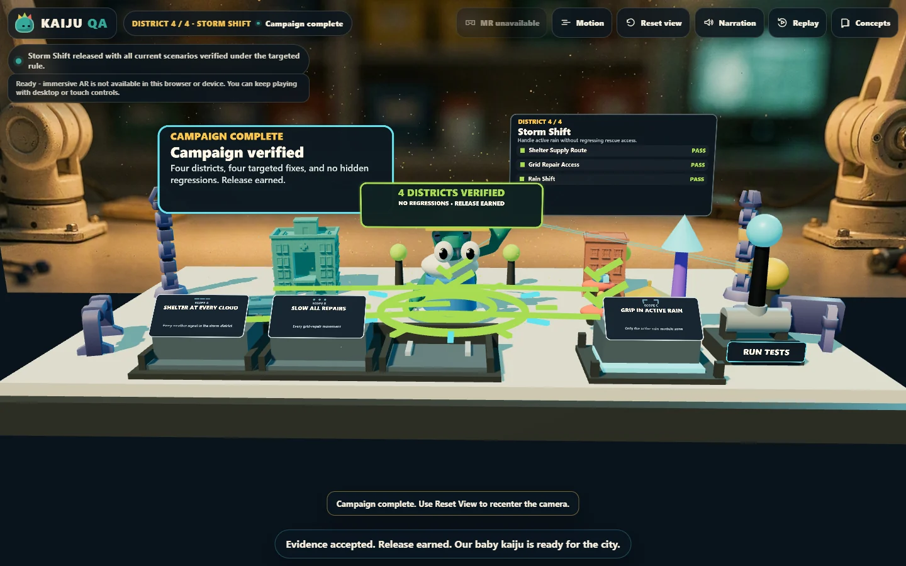
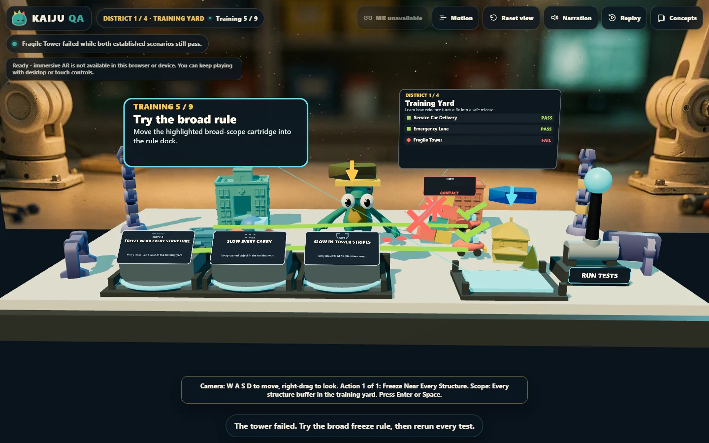
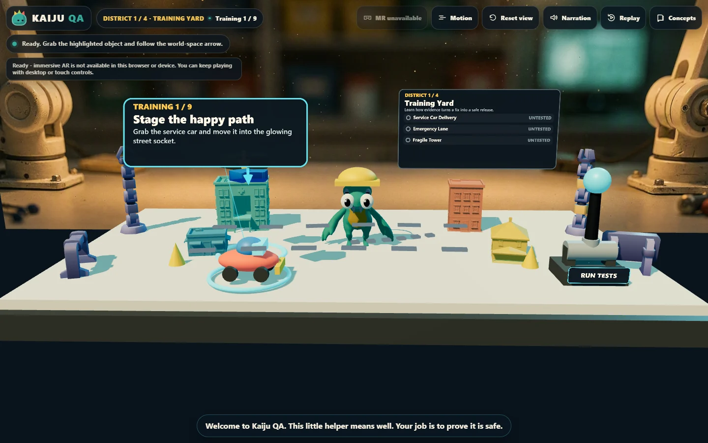
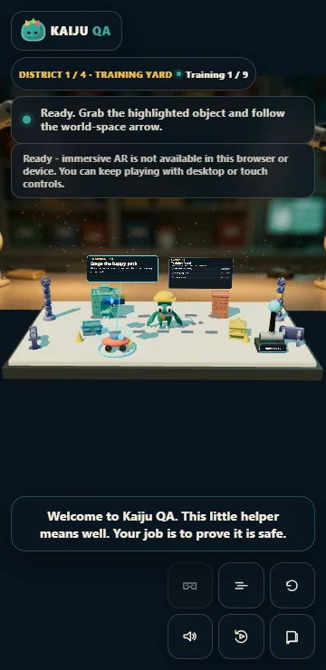

# Kaiju QA — OpenAI Build Week submission pack

Audit date: **July 21, 2026**
Official deadline: **July 21, 2026 at 5:00 PM Pacific Time**
(**July 22, 2026 at 00:00 UTC**)
Recommended category: **Education**

This file contains the copy, links, media, compliance audit, and final manual
steps needed to submit Kaiju QA. Before pasting the prose into Devpost, read it
out loud and make a few wording edits so it sounds unmistakably like you. The
project name **Kaiju QA** and tagline **Test small. Help big.** came from the
owner's project direction; this audit did not rename the project.

Official sources checked:

- <https://openai.devpost.com/>
- <https://openai.devpost.com/rules>
- <https://openai.devpost.com/details/faqs>
- <https://openai.devpost.com/updates/45402-deadline-tomorrow-last-minute-tips>

## Submission values

| Devpost field | Value |
| --- | --- |
| Project name | **Kaiju QA** |
| Tagline | **Test small. Help big.** |
| Category | **Education** |
| One-line pitch | A tactile browser game where learners test a helpful monster, catch regressions, narrow unsafe fixes, and earn release with evidence. |
| Public playable project | <https://soundguyai.github.io/OpenAIBuildWeek/> |
| Code repository | <https://github.com/SoundGuyAI/OpenAIBuildWeek> |
| Local final video master | `videos/kaiju-qa-devpost/renders/video.mp4` |
| YouTube URL | **TODO — upload, wait for processing, verify while signed out, and paste the final URL** |
| `/feedback` Codex Session ID | **TODO — retrieve from the primary Kaiju QA implementation thread** |
| Final submitted commit | **TODO — replace with the final `main` SHA after all submission changes are merged** |
| Repository license | **BLOCKER — the public repository currently has no root license** |
| Team | **TODO — confirm solo entry or that every invited teammate accepted** |
| Devpost state | **TODO — confirm the My Projects card is green and says Submitted, not Draft** |

## Short project description

Kaiju QA is a tactile educational game about a well-meaning baby kaiju whose
fast fixes are not always safe. Players stage test cases, run a baseline, add an
edge case, observe a regression, replace an over-broad rule with a targeted
one, rerun the complete suite, and stamp a release only when every result is
fresh and passing.

The same lesson runs from one browser codebase on desktop, mobile, and WebXR.
It turns an abstract AI-era engineering habit—goal, change, evidence, gate—into
something learners can see and manipulate.

## Inspiration

AI can produce a plausible change in seconds, but speed does not teach the
judgment needed to decide whether that change is safe. New developers often see
the happy path work and treat it as proof, even when an edge case or an old
requirement has quietly broken.

We wanted to make verification memorable without turning it into another
lecture or code editor. A helpful baby kaiju became the perfect metaphor: the
creature is trying to help, the first result looks impressive, and the real
monster is the regression nobody tested. That led to Kaiju QA, a short spatial
game where evidence—not confidence—earns the release.

## What it does

Kaiju QA teaches evidence-driven release judgment through direct interaction.
In the Training Yard, the player completes a nine-step guided sequence:

1. Stage a service-car scenario.
2. Pull the test lever and record a baseline.
3. Add a fragile-tower edge case.
4. Test before changing behavior.
5. Install an intentionally broad safety rule.
6. Rerun the old scenarios and catch the ambulance regression.
7. Replace the broad rule with a targeted slow zone.
8. Verify the full suite under the current rule.
9. Press the release stamp only after all evidence is current and passing.

Three transfer districts—School Crossing, Harbor Load, and Storm Shift—then
remove most of the tutorial scaffolding and ask players to apply the same loop
to new hazards. Wrong choices create useful, persistent evidence rather than a
game-over screen, so recovery is always one meaningful action away.

Desktop mouse, keyboard and switch-style actions, mobile touch, and XR
controller rays all map to the same verbs: grab, move, place, pull, and press.
Captions, narration controls, reduced motion, visible status words, and a
semantic non-canvas state summary keep the core lesson available beyond color
or animation alone.

## How we built it

The game is a TypeScript and Vite web application built on IWSDK 0.4.2. A pure,
renderer-independent reducer owns campaign progression, attempts, evidence
freshness, regressions, and release eligibility. The 3D scene is a projection
of that deterministic state, so an animation can never decide whether a test
passed or whether a release is allowed.

IWSDK interaction entities provide shared pointer, touch, keyboard, and XR-ray
behavior. Mixed-reality placement uses `immersive-ar`, hit testing, horizontal
surface validation, optional anchors, and a manual fallback. The production
build is static-host compatible and needs no account, backend, runtime model
call, or speech service.

Codex with GPT-5.6 was used as the build-time collaborator. It converted the
initial learning goal into acceptance criteria and a test matrix, researched
IWSDK constraints and licensing, implemented and reviewed independent code
slices, authored model and browser tests, diagnosed playtest findings, and
assembled the evidence and submission video. GPT-5.6 is not presented as an
in-game API feature; it was the reasoning model used through Codex to build and
verify the project.

The human owner retained the product decisions. They selected Kaiju QA, required
the step-by-step tactile tutorial, rejected the cluttered initial layout,
directed the full-bleed workbench and camera controls, requested passthrough
placement and draggable evidence cards, and required fixes for road layering
and task-arrow alignment before accepting the release.

## Challenges we ran into

### Teaching a real engineering idea without a lecture

The lesson had to show why a passing happy path is insufficient, why a broad fix
can regress old behavior, and why evidence becomes stale after a change. We
turned each concept into a physical action and kept earlier outcomes visible so
the player can compare runs instead of memorizing definitions.

### Keeping one interaction model across screens and headsets

Desktop, portrait mobile, and XR have very different reach, camera, and input
constraints. We used the same semantic game intents across mouse, touch,
keyboard, switch-style controls, and controller rays, then adapted presentation
and placement without creating a desktop-only alternate game.

### Making evidence readable in a busy 3D scene

Early playtesting exposed overlapping controls, cards, routes, and task arrows.
We rebuilt the scene as a full-bleed workbench, separated the rule rack and
installation dock, made evidence cards draggable with live target connectors,
fixed route depth behavior, and aligned the large and small task cues.

### Proving the submission rather than merely describing it

We kept a deterministic model suite, real browser interactions, desktop/mobile
evidence, IWER controller evidence, dated prompt logs, asset provenance, and
independent reviews. The demo video explicitly labels concept visualizations and
switches to a real browser capture for the working-product proof.

## Accomplishments that we're proud of

- A complete four-district campaign that teaches the full
  goal → change → evidence → gate loop.
- A deliberate broad-fix regression that makes the player's mistaken confidence
  visible without punishing experimentation.
- One static web build that remains playable without a headset and supports
  desktop, mobile, keyboard/switch access, and an XR controller path.
- A pure deterministic campaign model with **23 passing model/helper tests**.
- Passing merged-branch CI and a live GitHub Pages deployment.
- A documented, compact asset set using Quaternius and Kenney CC0 models,
  original/code-native visuals, and offline Kokoro narration.
- A **95.1-second** English demo master with captions, specific Codex/GPT-5.6
  narration, and a real working-prototype browser segment.

## What we learned

The strongest way to teach verification is to let a learner make a reasonable
mistake and then give them persistent evidence that explains the consequence.
Failure became more useful once it stopped being a reset screen and became a
comparison the player could act on.

We also learned that deterministic state and authored presentation are a strong
pair for educational 3D work. The reducer makes every pass, regression, stale
result, and gate testable; the spatial scene makes those same decisions
memorable. Separating the two let us iterate on visuals and input without
weakening the learning logic.

Finally, Codex was most valuable when paired with explicit human taste and
release gates. It accelerated research, implementation, testing, and review,
but the project improved when the owner challenged clutter, clarified the
intended physical interactions, and refused to ship visual defects that tests
alone would not catch.

## What's next for Kaiju QA and Loop Engineer

- Run a physical Quest headset comfort and performance pass in addition to the
  completed IWER controller/lifecycle verification.
- Complete a full screen-reader and switch-user campaign review.
- Add an instructor mode with a short debrief and classroom discussion prompts.
- Build a scenario authoring format so teachers can create new goals, edge
  cases, broad fixes, and release gates without changing the renderer.
- Expand Loop Engineer into additional short games that teach rollback,
  escalation, observability, and maintenance with the same evidence-first
  philosophy.
- Pilot the lesson with students or career switchers and measure whether they
  transfer the regression-checking habit to a real AI-assisted coding task.

## Built With

- Codex
- GPT-5.6
- IWSDK 0.4.2
- TypeScript
- Vite
- `@iwsdk/core` / Three.js
- WebXR and `immersive-ar`
- Playwright
- Node.js test runner
- GitHub Actions
- GitHub Pages
- Quaternius CC0 models
- Kenney Factory Kit CC0 models
- Blender 4.4
- Azure FLUX.2-pro for the optional laboratory backdrop and concept hero
- Kokoro-82M offline text-to-speech
- HyperFrames for the narrated competition video
- Python and Pillow for submission-image format conversion

## Codex and GPT-5.6 evidence for judges

Use this explanation in the README and submission form; do not reduce it to
"AI wrote the code."

> We built Kaiju QA in Codex with GPT-5.6 as the build-time reasoning model.
> Codex translated the learning goal into acceptance criteria, coordinated
> specialist research, implemented and tested independent slices, diagnosed
> browser and playtest findings, and assembled evidence for review. The owner
> chose the Kaiju QA concept and learning goals, rejected the cluttered first
> layout, specified the tactile controls and mixed-reality behavior, and held
> the release until route layering and task arrows were corrected. The shipped
> game has no runtime model dependency: GPT-5.6 and Codex were used to design,
> build, test, and review it.

Repository evidence:

- `docs/conversation/2026-07-20-kaiju-qa.md` — verbatim prompts and human decisions;
- `plans/kaiju-qa/PLAN.md` — acceptance criteria, architecture, risks, and test matrix;
- `plans/kaiju-qa/AGENT_ASSIGNMENTS.md` — specialist ownership and results;
- `evidence/kaiju-qa/` — browser, touch, XR, experience, and independent review;
- Git history from July 20–21 — implementation, playtest remediation, and review fixes; and
- `videos/kaiju-qa-devpost/` — video script, source, real prototype capture,
  render QA, and rights provenance.

The required Codex Session ID should be placed in the Devpost form, not copied
into a public README unless the owner deliberately wants it public.

## Demo video package

Final master:
`videos/kaiju-qa-devpost/renders/video.mp4`

- Duration: **95.1 seconds**
- Video: H.264, 1920×1080, 30 fps
- Audio: AAC, 48 kHz stereo
- SHA-256:
  `388d292f792c8043f36fc7934c90d948181f6cb9c9a524113ed44e031dc104ef`
- Voiceover: English, AI-assisted Kokoro narration, with captions
- Music: none
- Working-product proof: labeled browser capture of the real prototype
- Concept material: visibly labeled `CONCEPT VISUALIZATION — NOT GAMEPLAY CAPTURE`

The video passes the official duration and voiceover-content requirements. It
states what the game does and that GPT-5.6 and Codex shaped scoped plans, tests,
and review. The README and form copy above provide the more detailed
collaboration and human-decision account.

### Suggested YouTube title

`Kaiju QA — Loop Engineer | OpenAI Build Week`

### Suggested YouTube description

```text
Kaiju QA is a tactile educational game about proving AI-assisted changes are
safe before release. Stage a baseline, add an edge case, catch a regression,
narrow the fix, rerun the full suite, and earn the release.

Play: https://soundguyai.github.io/OpenAIBuildWeek/
Source: https://github.com/SoundGuyAI/OpenAIBuildWeek

Built during OpenAI Build Week with Codex and GPT-5.6.
```

### YouTube upload check

1. Upload the exact final MP4.
2. Choose **Public** visibility for the safest interpretation. The organizer's
   final update says unlisted is acceptable, but the main requirement uses the
   phrase public YouTube video.
3. Wait for the 1080p transcode to finish.
4. Open the URL in an incognito or signed-out browser.
5. Confirm the complete 95.1 seconds play, narration is audible, captions are
   visible, and the link resolves without an account.
6. Paste the canonical YouTube URL into Devpost.

## Devpost gallery PNG package

These are real gameplay captures converted from the committed WebP evidence to
PNG. No new AI-generated submission image was needed. All four PNG files are
valid RGB images and are below 1 MB.

### 1. Hero — release earned



- Upload file: `docs/submission/media/01-kaiju-qa-hero-release.png`
- Dimensions: 1440×900
- Caption: **Four districts verified. No regressions. Release earned.**
- Use: first/hero gallery image
- SHA-256:
  `dd7fa203124abf0c529da9047dc404ded7f9e9dedb2daaad3c62588148607dcb`

### 2. The regression lesson



- Upload file: `docs/submission/media/02-kaiju-qa-regression-test.png`
- Dimensions: 1440×900
- Caption: **A broad fix protects the tower—but the full suite reveals what it breaks.**
- Use: show the core educational mechanic
- SHA-256:
  `cf8e544cea642cb38e9fe7d26ddc7b27dd5e008a0d8bad52efa0ac7aa7f82653`

### 3. Guided Training Yard



- Upload file: `docs/submission/media/03-kaiju-qa-training-yard.png`
- Dimensions: 1440×900
- Caption: **A step-by-step tactile tutorial teaches the happy path before adding edge cases.**
- Use: explain onboarding, direct manipulation, and evidence UI
- SHA-256:
  `7816d3eed5ea456d26615837288007e2dc20f87d95beb09968fec2bc292f5a21`

### 4. Mobile browser



- Upload file: `docs/submission/media/04-kaiju-qa-mobile.png`
- Dimensions: 360×740
- Caption: **The same test loop works with touch in a portrait mobile browser.**
- Use: prove cross-device access
- SHA-256:
  `ae344bbbe1e1b23cf3b3641331dfc336b1fd2651dbfd2a91266e478d44ae9fbb`

Do not lead the gallery with
`videos/kaiju-qa-devpost/assets/kaiju-qa-hero.png`. It is attractive concept
art, but the real gameplay images above are stronger judge evidence. If the
concept image is used at all, label it clearly as concept visualization.

## Official requirement audit

| Requirement | Status | Evidence or required action |
| --- | --- | --- |
| Working project built with Codex and GPT-5.6 | **Ready** | Live static game, dated implementation history, README collaboration section, and video proof. |
| Project runs as described | **Ready** | Public Pages build loaded on July 21 with title `Kaiju QA`, complete accessible game state, and no browser console errors. |
| One category selected | **Manual action** | Select **Education** in the Devpost form. |
| Project description | **Ready** | Paste and human-edit the sections in this file. |
| Demo video under three minutes | **Ready locally** | Final master is 95.1 seconds. |
| Public YouTube video URL | **BLOCKER** | Upload and signed-out test are not recorded. |
| Voiceover explains the project, Codex, and GPT-5.6 | **Ready** | Video passes the official minimum; README/form copy adds specific detail. |
| `/feedback` Codex Session ID | **BLOCKER** | Retrieve from the primary implementation thread and enter it in Devpost. |
| Repository URL | **Ready** | Repository is public at the URL above. |
| Public repository has relevant licensing | **BLOCKER** | GitHub reports no root repository license. Choose and add one, or make the repo private and share it with both judging addresses. |
| Private repository sharing | **Not applicable if kept public** | If made private, share with `testing@devpost.com` and `build-week-event@openai.com`. |
| README setup and testing instructions | **Ready** | `npm ci`, build, preview, validation, controls, architecture, and evidence paths are documented. |
| README explains Codex and GPT-5.6 | **Ready on this branch** | New collaboration section names specific acceleration and human decisions. |
| Pre-existing versus new work documented | **Ready** | README, prompt logs, and dated commits show the shell and Kaiju QA work separately within the event period. |
| Plugin/developer-tool install path | **Not applicable** | Submit as an Education game, not a plugin or developer tool. |
| Free judge access | **Ready, keep online** | GitHub Pages URL is public. Keep it available through August 5, 2026 at 5:00 PM PT. |
| Third-party rights and licenses | **Ready with caveat** | Quaternius/Kenney, audio, fonts, FLUX, and video sources have ledgers. A root source-code license is still missing. |
| English materials | **Ready** | Game, README, form copy, captions, and narration are English. |
| Team members accepted | **Manual action** | Cannot be verified without the owner's Devpost login. |
| Submission is not a draft | **BLOCKER until verified** | Confirm the My Projects card is green and says **Submitted** before the deadline. |

## Judging-criteria positioning

The four criteria are equally weighted. Technological Implementation is listed
first and is also the first tie-break criterion.

| Criterion | What judges should notice | Best evidence |
| --- | --- | --- |
| Technological Implementation | Non-trivial Codex use, deterministic campaign logic, shared cross-device interactions, model/browser tests, and review discipline. | README collaboration section, model/test paths, CI, evidence folder, real browser segment in the video. |
| Design | A coherent product experience rather than a technical proof of concept. | Guided tutorial, direct physical verbs, persistent evidence, recovery, captions, mobile layout, and release transformation. |
| Potential Impact | A specific real audience practicing a specific AI-era skill. | Name CS students, bootcamp learners, career switchers, and instructors; emphasize transfer from happy-path confidence to evidence-based release judgment. |
| Quality of the Idea | The concept differs from code quizzes, prompt games, and SDLC diagrams. | A helpful kaiju, regression as the real monster, evidence as a physical object, and an earned miniature release stamp. |

Avoid claiming measured learning gains, physical Quest certification, or formal
assistive-technology certification. Those are future evaluation goals, not
current evidence.

## Final actions before submission

Complete these in order:

1. **Choose a repository license.** The repository is public but GitHub reports
   no root license. MIT is a common simple choice, but the owner must make the
   licensing decision. Keep the separate third-party asset/license ledgers.
2. **Upload the final MP4 to YouTube**, wait for 1080p processing, verify it
   signed out, and paste the URL into Devpost.
3. **Retrieve the Codex Session ID from the primary Kaiju QA build thread.** The
   FAQ says `/status` displays the Session ID; the final organizer update says
   to run `/feedback` from the slash-command menu and notes that `/status` also
   works. Start with `/feedback`, then use `/status` if needed, and copy the
   exact ID into the required form field.
4. **Open the Devpost submission while logged in.** The browser used for this
   audit was not registered/logged in, so the actual draft, team, category, and
   submission state could not be inspected.
5. **Select Education** and paste the human-edited sections from this file.
6. Add the public game URL, public repository URL, YouTube URL, and four PNG
   gallery images.
7. Confirm every teammate has accepted, or confirm this is a solo submission.
8. Test the public game once from a fresh browser and confirm the first
   interaction, reset, narration, and mobile layout.
9. Submit before **July 21, 2026 at 5:00 PM PT / July 22 at 00:00 UTC**.
10. Open **My Projects** and confirm the card is green and says **Submitted**,
    not Draft.
11. Keep the GitHub Pages build available, free, and unrestricted through the
    end of judging on **August 5, 2026 at 5:00 PM PT**.

No submission field, upload, team invitation, repository license selection, or
final Devpost submit action was performed by this audit.

## Audit verification record

- Current audited `main` commit: `0f418a029f22dc02a099dbbca0f7432ed4119cfb`
- Latest GitHub Pages deployment checked: Actions run `29843932349`, success
- Public deployment checked in a fresh browser: title and accessible Kaiju QA
  state loaded; no console errors were reported
- Repository visibility checked: public
- Root GitHub license detection: none
- Fresh local `npm run typecheck`: pass
- Fresh local `npm run test:model`: **23/23 pass**
- Fresh local `npm run build`: pass with the known large-chunk warning
- Fresh full local browser suite: exceeded this audit's ten-minute command
  limit; its process tree was terminated and no project process remained
- Current merged-source browser CI: pass in the recorded PR/Pages evidence
- Final video technical and competition review:
  `evidence/devpost-kaiju-qa-video/competition-review.md`
