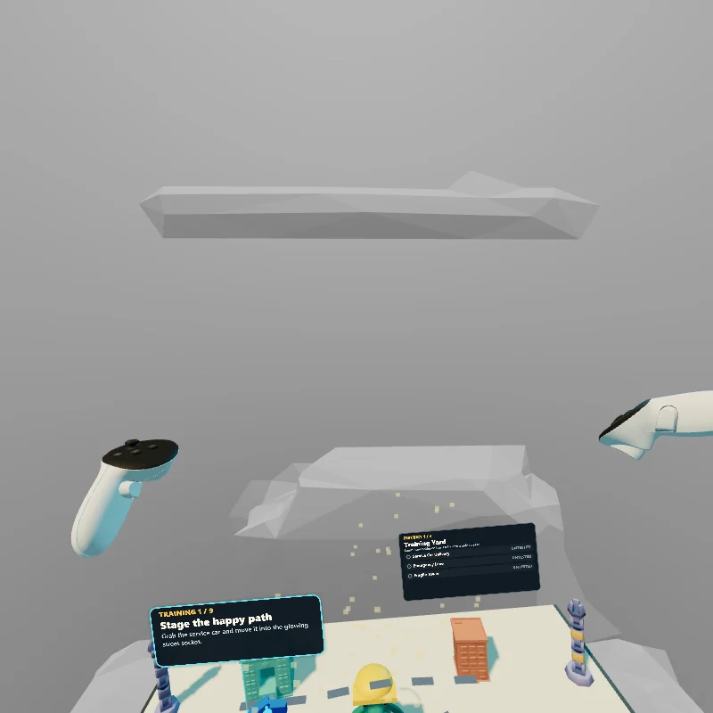

# XR QA: kaiju-qa

Branch: `feature/kaiju-qa`
Review date: 2026-07-21
Runtime under test: `https://localhost:8081/`, IWSDK `0.4.2`, IWER `Meta Quest 3`
Status: **PASS for the requested Quest 3 IWER controller/lifecycle path; physical-headset certification remains open**

## Verdict

The requested emulated XR path is runtime-certified in Quest 3 IWER. Both
controllers acquired ray targets, held and released trigger state, moved
grabbed objects, placed the service car and fragile tower into the training
socket, installed broad and targeted rule cartridges, pulled the lever four
times, pressed the release stamp, exited XR, re-entered XR, and successfully
used the stamp again after re-entry. The first district completed with 3/3
passing evidence, and the post-re-entry stamp advanced the game to `Stage 1 / 5
- School Crosswalk`.

This is not physical Quest 3 certification. Real optics, reach, tracking loss,
occlusion, haptics, controller ergonomics, thermal/performance behavior, and
comfort remain untested.



Evidence image: `evidence/kaiju-qa/03-vr.webp`, 800 x 800 WebP, 58,408 bytes.
It shows the in-headset world-space instruction/evidence panels, both Quest
controllers, all three training checks passing, and `TRAINING COMPLETE`.

## Runtime and bridge preflight

| Check | Exact result |
| --- | --- |
| IWSDK dev runtime | Port `8081` was already listening; no duplicate server was started. |
| Initial direct runtime status | `deviceName: Meta Quest 3`, `isRuntimeInstalled: true`, `sessionActive: false`, `sessionOffered: true`, `visibilityState: visible`. |
| XR entry | `accept_session {}` returned `{ "success": true }`; status changed to `sessionActive: true`, with `local-floor`, `bounded-floor`, `hand-tracking`, `viewer`, and `local` enabled. |
| Controller mode | `set_input_mode {"mode":"controller"}` returned active devices `controller-left` and `controller-right`. |
| Shared CLI registration | `.iwsdk/runtime/session.json` was concurrently registered to `https://127.0.0.1:4174/` while launch metadata still identified `8081`. `commandReady` was true, but normal CLI calls were routed to the wrong listener. |

The schema-valid PowerShell CLI probe was:

```powershell
& npx.cmd iwsdk xr set-input-mode --input-json '{\"mode\":\"controller\"}' --timeout 5000
```

Result: exit code `1`, `runtime_command_failed`, with
`EPROTO ... ssl3_get_record:wrong version number`. The JSON passed parsing; the
failure was transport routing to the concurrently registered `4174` listener.
It was not retried with alternate quoting.

The known-good `8081` bridge was recovered without changing repository state by
using the installed IWSDK transport directly:

```powershell
@'
import { sendRuntimeCommand } from '@iwsdk/cli';
const port = 8081;
const call = async (method, params = {}) =>
  (await sendRuntimeCommand({ port, method, params, timeoutMs: 20000 })).result;
'@ | node --input-type=module
```

This uses the same IWSDK runtime methods as the CLI, but pins the already-running
runtime port instead of reading the temporarily incorrect shared session file.

## Exact controller command record

All payloads below were executed through the `call` helper above.

### Session, controller mode, and diagnostics

```js
await call('get_session_status', {});
await call('get_device_state', {});
await call('accept_session', {});
await call('set_input_mode', {mode: 'controller'});
await call('set_connected', {device: 'controller-left', connected: true});
await call('set_connected', {device: 'controller-right', connected: true});
await call('get_scene_hierarchy', {maxDepth: 12});
await call('ecs_query_entity', {entityIndex: 15, components: ['Transform']});
await call('get_console_logs', {since: 1784604640000, count: 200, level: ['warn', 'error']});
await call('screenshot', {});
```

### Right-controller service-car grab and socket drop

```js
await call('set_transform', {
  device: 'controller-right', position: {x: 0.15, y: 1.35, z: 0.10}
});
await call('look_at', {
  device: 'controller-right', target: {x: -0.72, y: 1.015, z: -0.58}
});
await call('set_select_value', {device: 'controller-right', value: 1});
await call('set_transform', {
  device: 'controller-right', position: {x: 0.10, y: 1.28, z: -0.35}
});
await call('look_at', {
  device: 'controller-right', target: {x: -0.68, y: 1.015, z: -1.35}
});
await call('set_select_value', {device: 'controller-right', value: 0});
```

Observed ECS transform for entity `15`:

- Home: `[-0.72, 0.055, 0.87]`.
- While held near the socket: `[-0.7354, 0.055, -0.1790]`.
- After release/snap: `[-0.68, 0.055, 0.10]`.
- Trigger readback was `1` while held and `0` after release.

The fragile tower used the same right-controller ray/trigger sequence against
entity `16`; it moved while held and snapped from `[-0.72, 0.055, 0.87]` to
`[-0.68, 0.055, 0.10]`.

### Left-controller lever pull

This sequence was executed four times at the applicable training stages:

```js
await call('set_transform', {
  device: 'controller-left', position: {x: -0.10, y: 1.40, z: 0.20}
});
await call('look_at', {
  device: 'controller-left', target: {x: 1.38, y: 1.04, z: -0.72}
});
await call('set_select_value', {device: 'controller-left', value: 1});
await call('set_transform', {
  device: 'controller-left', position: {x: -0.05, y: 1.32, z: -0.20}
});
await call('look_at', {
  device: 'controller-left', target: {x: 1.38, y: 1.04, z: -1.02}
});
await call('set_select_value', {device: 'controller-left', value: 0});
```

Lever entity `23` moved from local Z `0.73` to `0.46` while held, exceeding the
authored `0.14` pull threshold, then returned to `0.73`. The four pulls advanced
baseline, tower failure, broad-rule regression, and targeted-rule 3/3 pass.

### Rule-cartridge socket drops

The broad rule (entity `20`) and targeted rule (entity `22`) used the same
ray/hold/move/release mechanism as the props. The synthetic ray-plane drag
retains the pointer-down offset, so the long broad-rule cross-table move needed
one calibrated `look_at` adjustment. The first broad attempt released outside
the `0.34` snap radius and correctly returned home; it did not advance state.

Final broad-rule aim and result:

```js
await call('look_at', {
  device: 'controller-right',
  target: {x: 0.1325088596343995, y: 0.975, z: -0.8334908103942871}
});
```

Entity `20` then snapped to `[0.68, 0.055, 0.62]`.

Final targeted-rule aim and result:

```js
await call('look_at', {
  device: 'controller-right',
  target: {x: 0.6034909343719483, y: 0.975, z: -0.8334908699989318}
});
```

Entity `22` then snapped to `[0.68, 0.055, 0.62]`.

### Right-controller release stamp

```js
await call('set_transform', {
  device: 'controller-right', position: {x: 0.10, y: 1.35, z: 0.15}
});
await call('look_at', {
  device: 'controller-right', target: {x: 1.38, y: 1.14, z: -1.23}
});
await call('set_select_value', {device: 'controller-right', value: 1});
await call('set_transform', {
  device: 'controller-right', position: {x: 0.10, y: 1.20, z: -0.10}
});
await call('look_at', {
  device: 'controller-right', target: {x: 1.38, y: 0.97, z: -1.23}
});
await call('set_select_value', {device: 'controller-right', value: 0});
```

Stamp entity `24` moved from local Y `0.34` to `0.19`, exceeding the authored
`0.09` press threshold, returned to `0.34`, and produced `TRAINING COMPLETE`
with all three evidence rows passing.

## Exit, re-entry, and hierarchy

Exact lifecycle calls:

```js
await call('end_session', {});
await call('get_session_status', {});
await call('get_scene_hierarchy', {maxDepth: 12});
await call('accept_session', {});
await call('get_session_status', {});
await call('get_scene_hierarchy', {maxDepth: 12});
```

| Observation | Before exit | After exit | After re-entry |
| --- | ---: | ---: | ---: |
| `sessionActive` | `true` | `false` | `true` |
| Scene root UUID | `f317a11e-ce3d-41c1-8f3c-9fdab5601688` | unchanged | unchanged |
| ECS entities in hierarchy | 25 | 25 | 25 |
| Hierarchy nodes | 214 | 210 | 214 |
| `LevelRoot` count | 1 | 1 | 1 |
| `KaijuQaToyLab` count | 1 | 1 | 1 |
| `car-drag-target` count | 1 | 1 | 1 |
| `lever-drag-target` count | 1 | 1 | 1 |
| `stamp-drag-target` count | 1 | 1 | 1 |

The four-node difference is the expected XR controller/session subtree. No
duplicate gameplay root, interaction target, or ECS entity appeared.

After re-entry, the stamp sequence was repeated successfully. The resulting
in-memory screenshot showed `STAGE 1 / 5 - Stage School Crosswalk`, proving that
controller capture/release and game progression remained functional after the
session cycle. Final cleanup called `end_session {}` once more; it returned
`{"success":true}` and left `sessionActive: false`, `sessionOffered: true`.

## Requested certification matrix

| Requirement | Result | Evidence |
| --- | --- | --- |
| Controller-ray pointing | **Pass in IWER** | `look_at` produced concrete left/right controller orientations and the pointed entities accepted trigger capture. Functional ray hit is certified; no persistent laser beam was visibly rendered. |
| Trigger grab | **Pass in IWER** | `set_select_value` read back `1`; target ECS transforms began following the controller. |
| Controller movement | **Pass in IWER** | Right-controller transforms and grabbed prop/rule transforms changed while select remained held. |
| Drop into a socket | **Pass in IWER** | Car entity `15` and tower entity `16` snapped to `[-0.68, 0.055, 0.10]`. |
| Lever pull | **Pass in IWER** | Left controller moved entity `23` from Z `0.73` to `0.46`; all four authored runs advanced. |
| Release stamp | **Pass in IWER** | Right controller moved entity `24` from Y `0.34` to `0.19`; training completed 3/3. |
| Exit/re-entry | **Pass in IWER** | Active -> inactive -> active; stable root UUID and 25 entities; post-re-entry stamp advanced districts. |
| Scene hierarchy | **Pass** | 214 active-XR nodes, 25 entities, one gameplay root and one of each named interaction target. |

## Findings and limitations

### Blocking for broader claims

1. **Physical-headset testing remains a gap.** This run cannot certify real
   Quest 3 tracking, reach, haptics, optics, comfort, performance, controller
   loss/recovery, or hand/controller switching.
2. **The standard CLI bridge was not reproducible in the shared worktree.** A
   concurrent `4174` runtime registration caused schema-valid CLI commands to
   fail with TLS `EPROTO`, despite `commandReady: true`. The `8081` runtime
   itself remained healthy and was exercised through IWSDK's direct transport.
   Fix or isolate runtime registration before relying on copy-paste CLI
   reproduction.

### Non-blocking observations

- IWER reported `stereoEnabled: false`; the captured evidence is a monoscopic
  800 x 800 runtime view, not headset optics.
- The only warning generated during this verification window was
  `THREE.WebGLRenderer: Can't change size while VR device is presenting.` No
  visible state loss followed it, but resize handling during active XR should
  be watched.
- Older retained console entries, predating this run, repeatedly reported
  `Entity N is destroyed, cannot remove component` for entities 15-24 during
  page reload/teardown. Exit/re-entry did not reproduce them. This suggests a
  possible double-cleanup issue around `scene.dispose()` and world teardown;
  investigate separately if reload cleanliness is a release requirement.
- The first broad-rule synthetic drag missed the snap radius and returned home
  as designed. IWER's exact ray-plane offset required calibrated aiming for the
  long cross-table move; a physical controller may have different ergonomics.

## Final classification

**IWER PASS / PHYSICAL DEVICE PENDING.** No blocking gameplay-source defect was
found in the requested emulated controller, socket, lever, stamp, lifecycle, or
hierarchy path. Do not describe the feature as physically tested on Quest 3
until a headset run closes the remaining device gap.
